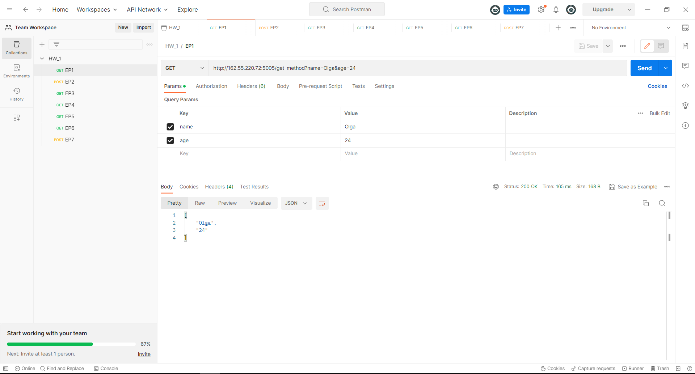
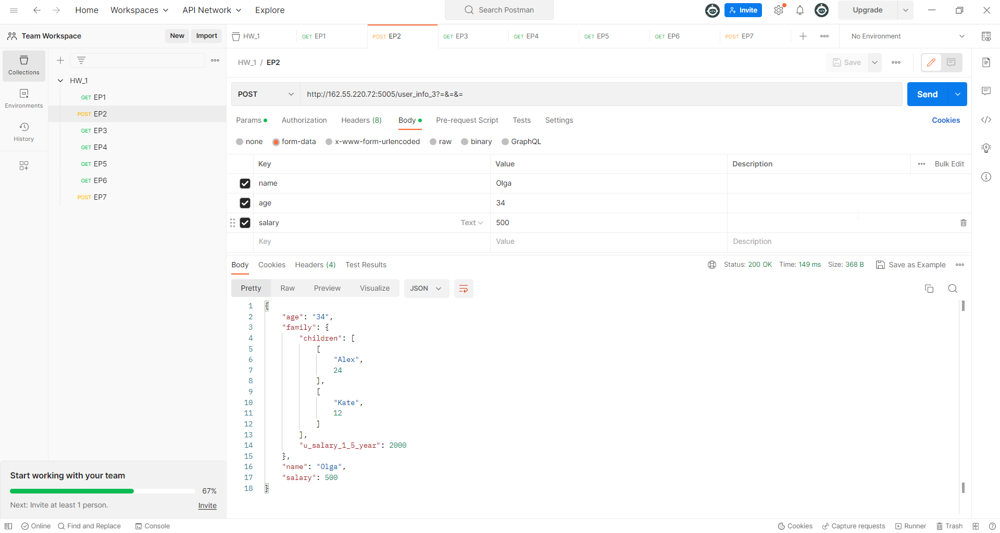
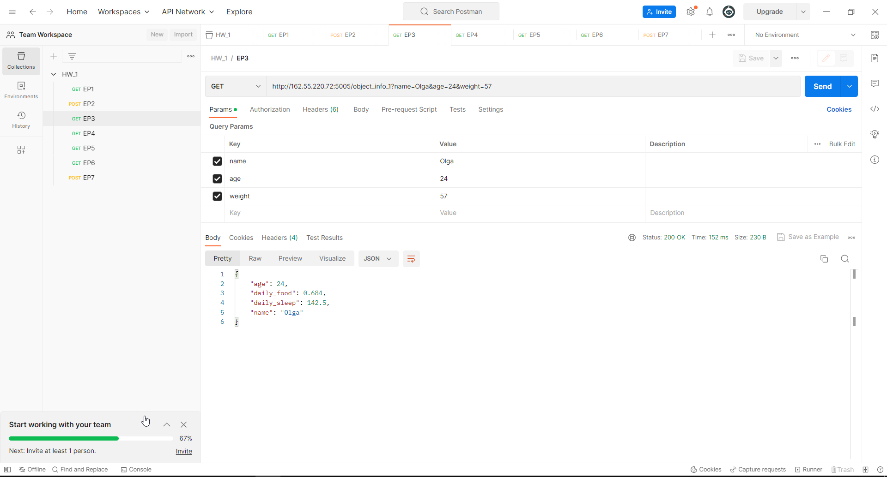
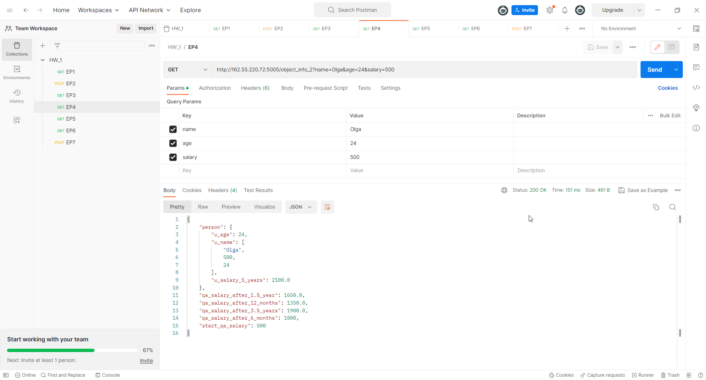
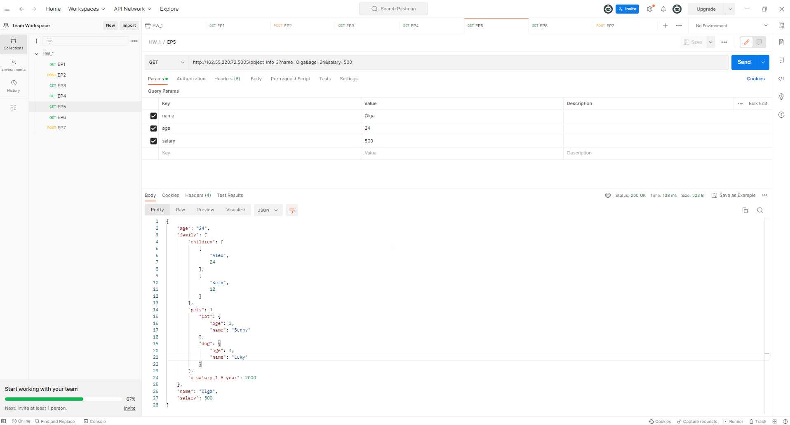
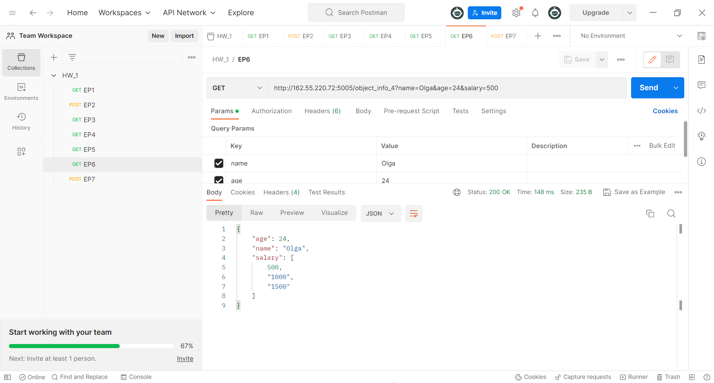
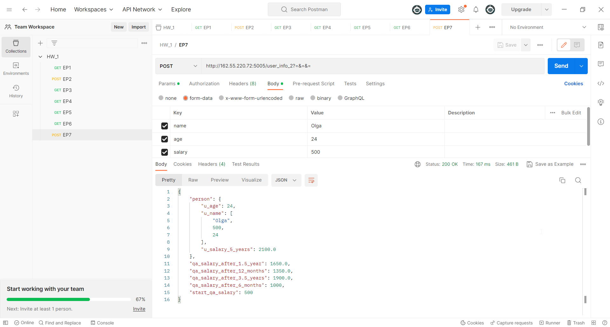

## CREATE REQUESTS IN POSTMAN
_____
Protocol: http

IP: 162.55.220.72

Port: 5005

## EP_1
method: GET
end_point: /get_method
request url params:
- name: str
- age: int

## EP_2
method: POST
end_point: /user_info_3
request url params:
name: str
- age: int
- salary: int

## EP_3
method: GET
end_point: /object_info_1
request url params:
- name: str
- age: int
- salary: int

## EP_4
method: GET
end_point: /object_info_2
request url params:
- name: str
- age: int
- salary: int

## EP_5
method: GET
end_point: /object_info_3
request url params:
- name: str
- age: int
- salary: int

## EP_6
method: GET
end_point: /object_info_4
request url params:
- name: str
- age: int
- salary: int

## EP_7
method: POST
end_point: /user_info_2
request url params:
name: str
age: int
salary: int

