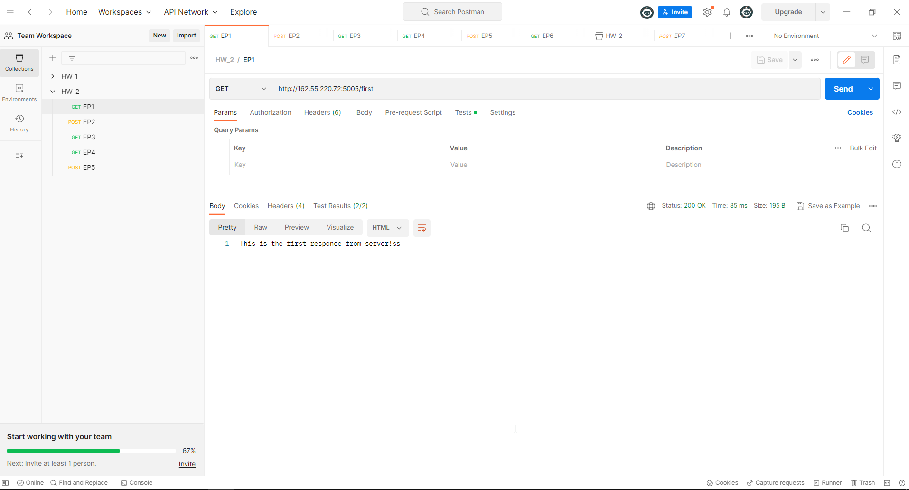
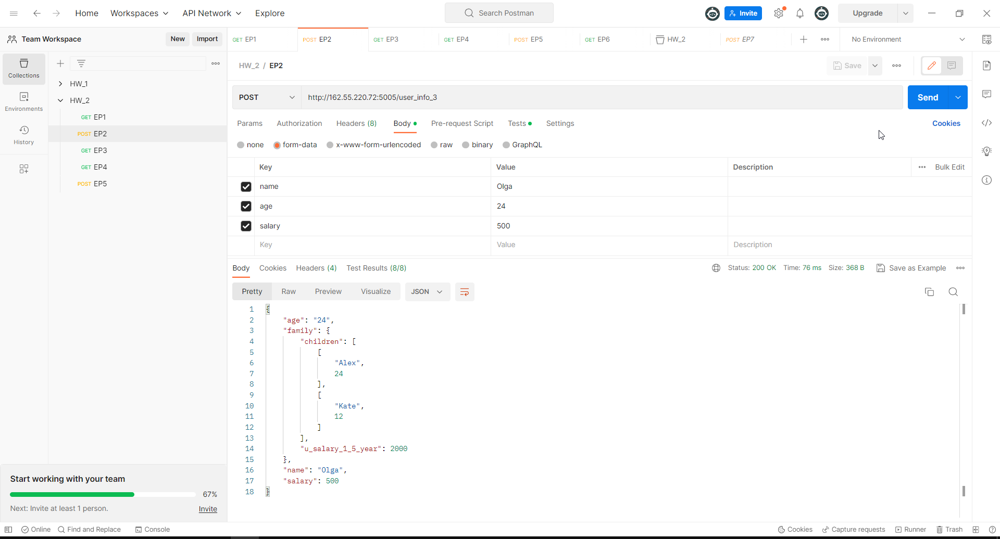
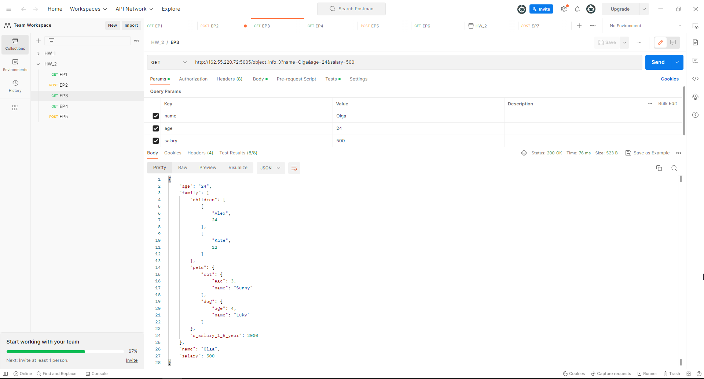
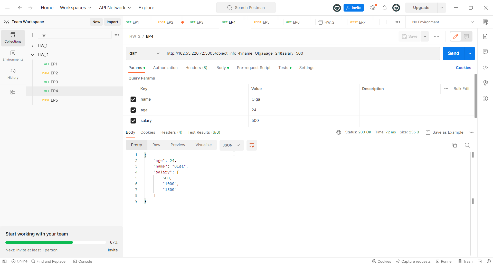
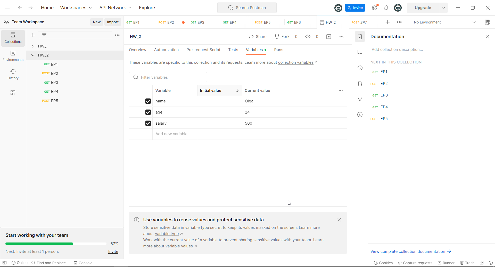
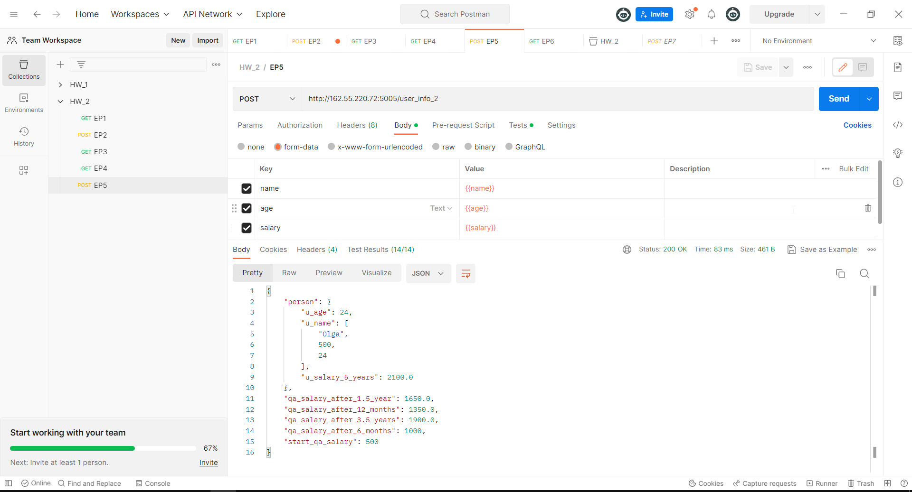

# EP_1
## http://162.55.220.72:5005/first
____
### 1. Send request.


### 2. Check that status code is 200.
```
pm.test("Status code is 200", function () {
  pm.response.to.have.status(200);
});
```
_____
### 3. Check that in the body comes correct string.
```
pm.test("Body is correct", function () {
    pm.expect(pm.response.text()).to.include("This is the first responce from server!ss");
});
```
____
# EP_2
## http://162.55.220.72:5005/user_info_3
____
### 1. Send request.


### 2. Check that status code is  200.
```
pm.test("Status code is 200", function () {
    pm.response.to.have.status(200);
});
```
____

### 3. Parse response body in json.
```
let response_Json=pm.response.json();
```
____

### 4. Check that the name in the answer is name s request (name write by hand).
```
pm.test("Name is Olga", function () {
    pm.expect(response_Json).to.have.property("name", "Olga");
});
```
____

### 5. Check that the age in the answer is age s request (age write by hand).
```
pm.test("Age is 24", function () {
  pm.expect(response_Json).to.have.property("age", "24");
});
```
_____
### 6. Check that the salary in the answer is equal salary s request (salary write by hand).
```
pm.test("Salary is 500", function () {
  pm.expect(response_Json).to.have.property("salary",500);
});
```
____
### 7. Parse request.
```
let parsing_request = request.data;
```
____
### 8. Check that the name in the answer is name s request (name take from request).
```
pm.test('name from request', function(){
    pm.expect(response_Json.name).to.equal(parsing_request.name);
});
```
____
### 9. Check that age in response is equal age s request (age take from request).
```
pm.test('age from request', function(){
    pm.expect(response_Json.age).to.equal(parsing_request.age);
});
```
____
### 10. Check that the salary in the response is equal salary s request (salary take from request).
```
pm.test('salary from request',function(){
pm.expect(response_Json.salary).to.equal(+parsing_request.salary);
});
```
____
### 11. Display the family option from response in the console.
```
console.log(response_Json.family);
```
____
### 12. Check that u_salary_1_5_year in the answer is equal salary*4 (salary take from request).
```
pm.test('salary from request',function(){
pm.expect(response_Json.family.u_salary_1_5_year).to.equal (parsing_request.salary*4);
});
```
_____
# EP_3
## http://162.55.220.72:5005/object_info_3
______
### 1. Send request.


### 2. Check the status code is 200.
```
pm.test("Status code is 200", function () {
    pm.response.to.have.status(200);
});
```
### 3. Parse response body in json.
```
let response_Json=pm.response.json();
```
_____
### 4. Parse request.
```
let parsing_request = request.data;
```
_____
### 5. Check that the name in the answer is name s request (name take from request).
```
pm.test("Name is Olga", function () {
    pm.expect(response_Json).to.have.property("name", "Olga");
});
```
______
### 6. Check that age in response is equal age s request (age take from request).
```
pm.test("Age is 24", function () {
  pm.expect(response_Json).to.have.property("age", "24");
});
```
____
### 7. Check that the salary in the response is equal salary s request (salary take from request).
```
pm.test("Salary is 500", function () {
  pm.expect(response_Json).to.have.property("salary",500);
});
```
_____
### 8. Display the family parameter from response in the console.
```
console.log(response_Json.family);
```
____
### 9. Check that the dog parameter has the name parameter.
```
pm.test("Dog's name is Luky", function () {
  pm.expect(response_Json.family.pets.dog).to.have.property("name");
});
```
____
### 10. Check that the dog parameter has age parameter.
```
pm.test("Dog's name is Luky", function () {
  pm.expect(response_Json.family.pets.dog).to.have.property("age");
});
```
____
### 11. Check that the name parameter has a value Luky.
```
pm.test("Dog's name is Luky", function () {
  pm.expect(response_Json.family.pets.dog.name).to.eql ("Luky");
});
```
_____
### 12. Check that age parameter it has a value 4.
```
pm.test("Luky's age is 4", function () {
  pm.expect(response_Json.family.pets.dog.age).to.eql (4);
});
```
_____
# EP_4
http://162.55.220.72:5005/object_info_4
___
### 1. Send request.


### 2. Check the status code is 200.
```
pm.test("Status code is 200", function () {
    pm.response.to.have.status(200);
});
```
____
### 3. Parse response body in json.
```
let response_Json=pm.response.json();
```
___
### 4. Parse request.
```
let parsing_request = request.data;
```
____
### 5. Check that the name in the answer is name s request (name take from request).
```
pm.test("Name is Olga", function () {
    pm.expect(response_Json).to.have.property("name", "Olga");
});
```
___
### 6. Check that age in response is equal age from request (age take from request).
```
pm.test("Age is 24", function () {
  pm.expect(response_Json).to.have.property("age", 24);
});
```
___
### 7. Display the salary parameter from request in the console.
```
console.log(parsing_request.salary);
```
___
### 8. Display the salary parameter from response in the console.
```
console.log(response_Json.salary);
```
___
### 9. Display the 0th element of the salary parameter from the response to the console.
```
console.log(response_Json.salary[0]);
```
___
### 10. Display the 1th element of the salary parameter from the response to the console.
```
console.log(response_Json.salary[1]);
```
___
### 11. Display the 2th element of the salary parameter from the response to the console.
```
console.log(response_Json.salary[2]);
```
____
### 12. Check that the 0th element of the salary parameter is equal to the salary from the request (salary to be taken from the request).
```
pm.test("0 salary element = salary from req", function () {
  pm.expect(response_Json.salary[0]).to.eql (+parsing_request.salary);
});
```
____
### 13. Check that the 1st element of the salary parameter is equal to the salary*2 of the request (salary take from request).
```
pm.test("1 salary element = salary from req", function () {
  pm.expect(+response_Json.salary[1]).to.eql (parsing_request.salary*2);
})
```
___
### 14. Check that the 2nd element of the salary parameter is equal to the salary*3 of the request (salary take from request).
```
pm.test("2 salary element = salary from req", function () {
  pm.expect(+response_Json.salary[2]).to.eql (parsing_request.salary*3);
});

```
____
### 15. Create the name variable in the environment.

### 16. Create an age variable in the  environment.

### 17. Create a salary variable in the environment.


### 18. Send the name variable to the environment.
```
pm.environment.set("name", "Olga");
```
_____
### 19. Send the age variable to the environment.
```
pm.environment.set("age", 24);
```
____
### 20. Send the salary variable to the environment.
```
pm.environment.set("salary", 500);
```
____
### 21. Write a cycle that will display the list elements from the salary parameter into the console in order.
```
response_Json.salary.forEach(element =>{
console.log(element);
});
```
```
for (let i = 0; i<response_Json.salary.length; i++){
console.log(response_Json.salary[i]);    
};
```
______
# EP_1
## http://162.55.220.72:5005/user_info_2
____

### 1. Insert the salary parameter from the environment into request.
### 2. Insert the age parameter from the environment into age.
### 3. Insert the name parameter from the environment into name.
### 4. Submit a request.


### 5. Check status code is 200.
```
pm.test("Status code is 200", function () {
    pm.response.to.have.status(200);
});
```
____
### 6. Parse response body to json.
```
let response_Json=pm.response.json();
```
____
### 7. Parse request.
```
let parsing_request = request.data;
```
____
### 8. Check json response has start_qa_salary parameter.
```
pm.test("The first QA salary", function () {
pm.expect(response_Json).to.have.property("start_qa_salary");
});
```
____
### 9. Check json response has qa_salary_after_6_months parameter.
```
pm.test("QA salary after 6 months", function () {
pm.expect(response_Json).to.have.property("qa_salary_after_6_months");
});
```
____
### 10. Check json response has qa_salary_after_12_months parameter.
```
pm.test("QA salary after 12 months", function () {
pm.expect(response_Json).to.have.property("qa_salary_after_12_months");
});
```
____
### 11. Check json response has qa_salary_after_1.5_year parameter.
```
pm.test("QA salary after 1.5 year", function () {
pm.expect(response_Json).to.have.property("qa_salary_after_1.5_year");
});
```
____
### 12. Check json response has qa_salary_after_3.5_years parameter.
```
pm.test("Response there is person", function () {
pm.expect(response_Json).to.have.property("person");
});
```
_____
### 13. Check json response has person parameter.
```
pm.test("Response there is person", function () {
pm.expect(response_Json).to.have.property("person");
});
```
____
### 14. Check that the start_qa_salary parameter is equal to salary from request (pick salary from request).
```
pm.test("Start QA salary equal salary", function () {
pm.expect(response_Json.start_qa_salary).to.eql (+parsing_request.salary);
});
```
_____
### 15. Check that the qa_salary_after_6_months parameter is equal to salary*2 from request (pick salary from request).
```
pm.test("The QA salary after 6 months equal salary", function () {
pm.expect(response_Json.qa_salary_after_6_months).to.eql (parsing_request.salary*2);
});
```
_____
### 16. Check that the qa_salary_after_12_months parameter is equal to salary*2.7 from request (pick salary from request).
```
pm.test("The QA salary after 12 months equal salary", function () {
pm.expect(response_Json.qa_salary_after_12_months).to.eql (parsing_request.salary*2.7);
});
```
____
### 17. Check that the qa_salary_after_1.5_year parameter is equal to salary*3.3 from request (pick salary from request).
```
pm.test("The QA salary after 1.5 year equal salary", function () {
pm.expect(response_Json['qa_salary_after_1.5_year']).to.eql (+parsing_request.salary*3.3);
});
```
____
### 18. Check that the qa_salary_after_3.5_years parameter is equal to salary*3.8 from request (pick salary from request).
```
pm.test("The QA salary after 3.5 years equal salary", function () {
pm.expect(response_Json['qa_salary_after_3.5_years']).to.eql (+parsing_request.salary*3.8);
});
```
____
### 19. Check that in the person parameter, the 1st element from u_name is equal to salary from request (pick salary from request).
```
pm.test("U_name equal salary", function () {
pm.expect(response_Json.person.u_name[1]).to.eql (+parsing_request.salary);
});
```
_____
### 20. Check that the u_age parameter is equal to age from request (take age from request).
```
pm.test("U_name equal age", function () {
pm.expect(response_Json.person.u_age).to.eql (+parsing_request.age);
});
```
____
### 21. Check that the u_salary_5_years parameter is equal to salary*4.2 from request (pick salary from request).
```
pm.test("U_salary_5_years equal salary*4.2 ", function () {
pm.expect(response_Json.person.u_salary_5_years).to.eql (+parsing_request.salary*4.2);
});
```
____
### 22. ***Write a cycle that will display the list items from the person parameter to the console in order.
```
for (let i = 0; i<response_Json.person.length; i++){
console.log(response_Json.person[i]);    
}; 
```
___
